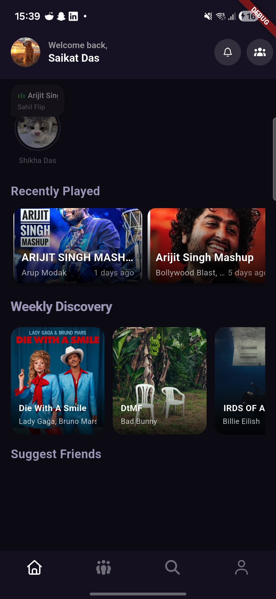
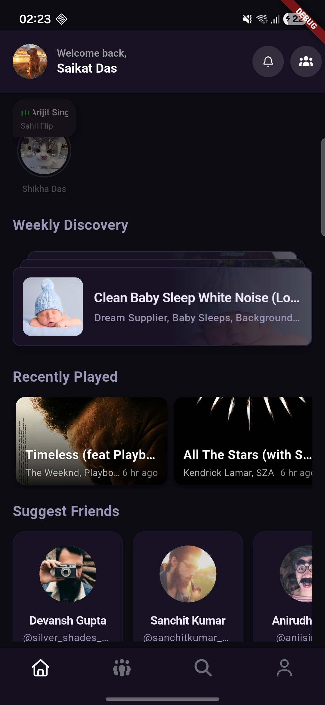
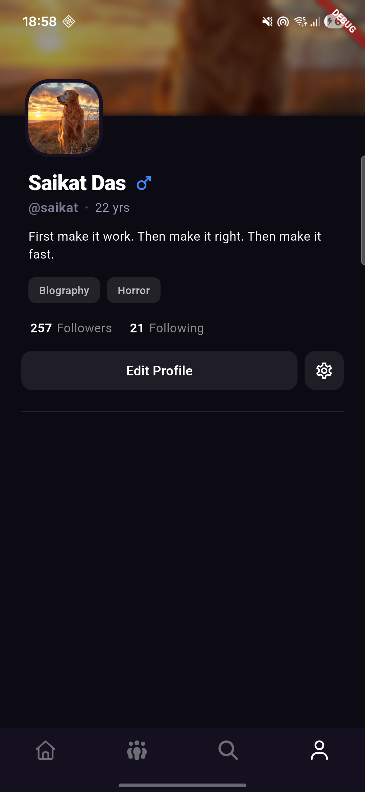

<p align="center">
  
</p>

<h1 align="center">Bluppi</h1>

<p align="center">
  <em>Listen together. Vibe together.</em>
</p>

<p align="center">
  
  
  
  
  
  
</p>

---

Bluppi is a real-time synchronized music platform where users create rooms, listen to tracks together, and chat live — all synced across devices through gRPC streaming. Built with Flutter + Riverpod on the client and a distributed Go backend.

> **🔗 Backend**: [bluppi-backend](https://github.com/dis70rt/bluppi-backend) — Go microservices powering UserService, TrackService, and RoomService via gRPC.

---

## 📸 Screenshots

<p align="center">
  
  &nbsp;&nbsp;
  
  &nbsp;&nbsp;
  
</p>

<p align="center">
  <sub>Home · Discovery · Profile</sub>
</p>

---

## ✨ Features

- 🎵 **Music**: Real-time synchronized playback with `just_audio`. Includes queue management, swipe-to-minimize floating player, and weekly discovery feeds.

- 👥 **Social**: Create/join rooms with live chat. Follow system, user profiles with genre tags, and suggested friends.

- 🔍 **Discovery**: Full-text track search (Solr-backed) with cursor-paginated infinite scroll and liked tracks library.

- 🔐 **Auth**: Firebase Google Sign-In with a comprehensive onboarding flow and profile customization.

### ⚡ UX Details
- Skeleton loading screens for seamless transitions
- Lottie animations for playing indicators
- Swipe-to-minimize floating player (snaps to left/right edge)
- Pull-to-refresh on followers/following lists
- Leak-free logout with full provider teardown

---

## 📦 Download

> **Latest release**: [GitHub Releases](https://github.com/dis70rt/bluppi/releases)
>
> Download the APK directly from the Releases page. No Play Store needed.

### Requirements

| | Minimum |
|---|---|
| **Android** | API 21 (Lollipop 5.0) |
| **Storage** | ~50 MB |
| **Network** | Required (streaming app) |

---

## 🛠 Tech Stack

| Layer | Technology |
|---|---|
| **Framework** | Flutter 3.10.7+ / Dart 3.x |
| **State Management** | Riverpod 3.2 (`AsyncNotifier`, `.autoDispose`, `.family`) |
| **Networking** | gRPC + Protocol Buffers (HTTP/2) |
| **Auth** | Firebase Auth + Google Sign-In |
| **Audio** | `just_audio` + `audio_service` (background playback) |
| **Navigation** | GoRouter with `refreshListenable` auth redirects |
| **Caching** | `cached_network_image`, `shared_preferences` |
| **UI Polish** | Lottie, Skeletonizer, `fl_chart` |

---

## 🚀 Build from Source

### Prerequisites

- [Flutter SDK](https://docs.flutter.dev/get-started/install) `>= 3.10.7`
- [Protocol Buffers Compiler](https://grpc.io/docs/protoc-installation/) (`protoc`)
- gRPC Dart plugin:
  ```bash
  dart pub global activate protoc_plugin
  ```
- [Firebase CLI](https://firebase.google.com/docs/cli) (for `google-services.json`)
- Android SDK (via Android Studio or standalone)

### 1. Clone & Install

```bash
git clone https://github.com/dis70rt/bluppi.git
cd bluppi
flutter pub get
```

### 2. Firebase Setup

Place your `google-services.json` in:
```
android/app/google-services.json
```

> You need a Firebase project with **Authentication** (Google Sign-In) enabled.

### 3. Environment Configuration

Create a `.env` file in the project root:

```env
GRPC_SERVER_ADDRESS=your-server.example.com
GRPC_SERVER_PORT=443
GATEWAY_SERVER_ADDRESS=your-server.example.com
GATEWAY_SERVER_PORT=443
AUDIO_SERVER_URL=https://your-server.example.com/api/rest
```

### 4. Generate Protobuf Code

```bash
chmod +x protobuf.sh
./protobuf.sh
```

Or manually:
```bash
protoc --dart_out=grpc:lib/generated \
    -Ilib/protobufs \
    -I/usr/include \
    lib/protobufs/*.proto \
    google/protobuf/timestamp.proto
```

### 5. Run

```bash
flutter run
```

### ADB Port Forwarding (local backend dev)

If running the backend locally, forward gRPC ports to your Android device:
```bash
adb reverse tcp:50051 tcp:50051
adb reverse tcp:8001 tcp:8001
```

---

## 🔗 Backend

Bluppi requires the **bluppi-backend** to function. The backend exposes three gRPC services:

| Service | Responsibilities |
|---|---|
| **UserService** | Auth, profiles, follow system, suggested friends, search |
| **TrackService** | Track metadata, search (Solr), history, likes, top tracks |
| **RoomService** | Room CRUD, member management, live chat, playback sync |

> 🔗 **[bluppi-backend](https://github.com/dis70rt/bluppi-backend)** — See the backend repo for server setup, database schema, and gRPC service definitions.

---

## 📋 Changelog

| Version | Date | Highlights |
|---|---|---|
| `v1.0.0-alpha` | 2026-04 | Core music streaming, rooms, live chat, profiles, follow system, search, floating player, edit profile, logout teardown |

---

## 📚 Documentation

For deeper dives into the project internals, see:

- **[Architecture & Flow](docs/ARCHITECTURE.md)** — Flutter architecture, state management patterns, and data flow
- **[Production Engineering](docs/PRODUCTION.md)** — Production-grade techniques, optimizations, and infrastructure decisions

---

## 🤝 Contributing

Contributions are welcome! Please follow the issue-first workflow:

1. **Open an issue** describing the bug or feature
2. **Fork** the repo and create a branch from `main`
3. **Submit a PR** referencing the issue

---

## 📄 License

This project is licensed under the **MIT License** — see the [LICENSE](LICENSE) file for details.

---

<p align="center">
  <sub>Built with ❤️ by <a href="https://github.com/dis70rt">dis70rt</a></sub>
</p>
