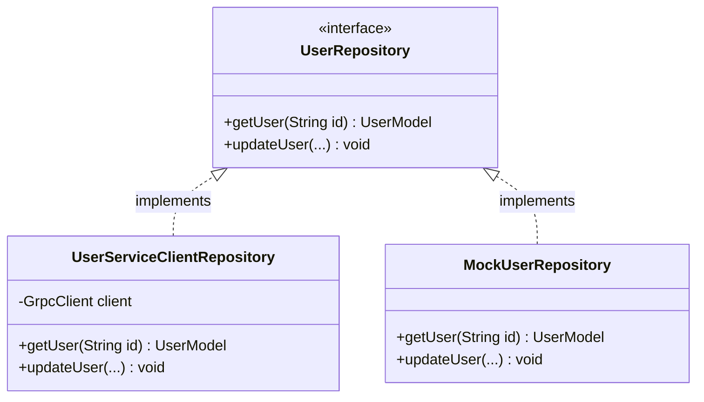
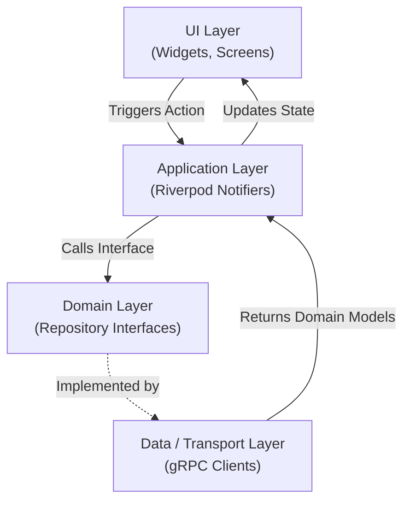
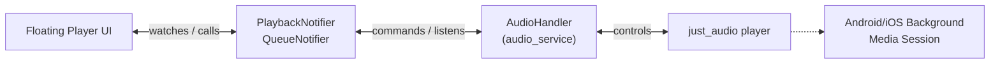

# Architecture & Flow

Bluppi's mobile client follows a strict **Clean Architecture** combined with **Feature-First** (or Layer-First) grouping to ensure scalability, maintainability, and clear separation of concerns.

## Folder Structure & Layer Overview

The `lib/` directory is divided into distinct layers, each with a single responsibility. This prevents business logic from leaking into UI components and decouples the application from specific technologies (like gRPC or Firebase).

```text
lib/
├── ui/              # Presentation Layer (What the user sees)
├── application/     # State Management Layer (How the app behaves)
├── domain/          # Business Logic Layer (What the app is)
├── data/            # Transport/Infrastructure Layer (Where data comes from)
├── core/            # App-wide constants, themes, and utilities
├── navigation/      # Routing logic (GoRouter)
└── generated/       # Code generated from Protobufs
```

### 1. Presentation Layer (`ui/`)
Contains only Flutter widgets and screens. This layer has **no business logic** and makes no direct API calls. It simply watches Riverpod providers from the Application layer and builds the UI based on the state.

### 2. Application Layer (`application/`)
The glue between the UI and the data. It contains Riverpod providers, notifiers, and controllers. This layer maintains the app's state, handles user interactions, orchestrates multiple repositories, and provides a clean stream of state to the UI.

### 3. Domain Layer (`domain/`)
The core of the application. It defines **what** the app does using standard OOP principles:
- **Models**: Pure Dart classes representing business entities (`UserModel`, `TrackModel`), independent of any network protocol or database schema. (We map Protobuf messages into these pure models).
- **Repository Interfaces**: Abstract classes (`abstract class UserRepository`) defining the contracts for data access. The Domain layer doesn't care *how* data is fetched, only *what* data is expected.

### 4. Transport / Data Layer (`data/`)
This is the implementation layer. It is responsible for talking to the outside world, getting data, and converting it into the pure Domain models. 

**Why separate Domain and Data?**
The Application layer only communicates with the `domain/` interfaces. The `data/` layer implements these interfaces (e.g., using gRPC, REST, or local SQLite). If we decide to switch from gRPC to WebSockets or an HTTP REST API, we **only** write a new Transport implementation in `data/`. The UI, Application, and Domain layers remain completely untouched because they only know about the abstract interfaces.

---

## The "OOPs" of File Structuring (Repository Pattern)

Bluppi heavily utilizes Object-Oriented Programming principles—specifically **Polymorphism** and **Dependency Inversion**—to structure data access.



1. **The Contract (`domain/repositories/user_repository.dart`)**: We define an abstract class `UserRepository`. 
2. **The Implementation (`data/grpc/repositories/user_service_client.dart`)**: We create a class that `implements UserRepository`. This class handles the nitty-gritty of gRPC, creating requests, and parsing responses into Domain models.
3. **The Injection**: Riverpod injects the implementation into the Application layer as the abstract type. The Application layer asks for `UserRepository`, and Riverpod hands it `UserServiceClientRepository`.

---

## Data Flow 

Data flows in a unidirectional manner. The UI dispatches an action, the Application layer processes it via Domain interfaces, the Data layer fulfills it, and the Application layer updates the state, triggering a UI rebuild.



### Example: Searching for a Track

1. **UI**: User types "Blinding Lights" in the search bar. The widget calls `ref.read(searchTrackProvider.notifier).setQuery("Blinding Lights")`.
2. **Application**: The `SearchTrackNotifier` manages a debounce timer. When it fires, it calls `trackRepository.searchTrack()`.
3. **Domain**: `TrackRepository` (interface) enforces the `searchTrack` method signature.
4. **Data**: `TrackServiceClientRepository` (the concrete transport layer) builds a `SearchTracksRequest` Protobuf, fires it over HTTP/2 via gRPC, receives the response, and converts the Protobuf repeated fields into a clean `List<SearchTrackModel>`.
5. **Application**: The `SearchTrackNotifier` sets its state to `AsyncData(results)`.
6. **UI**: The widget watching `searchTrackProvider` rebuilds to show the list of tracks.

---

## Audio Architecture

Bluppi uses `just_audio` for playback and `audio_service` for OS-level background playback controls.



- **AudioHandler**: Runs in an isolate to keep music playing when the app is in the background. It listens to commands (play, pause, skip) and broadcasts the current playback state and position.
- **Providers**: `playerProvider` bridges the gap between the Riverpod ecosystem and the `AudioHandler` streams, converting raw audio states into Riverpod state so the UI can easily react.
- **Queue System**: A separate `QueueNotifier` manages the playlist (user-added versus autoplay), and feeds the next track URL into the AudioHandler seamlessly.

---

## State Management Patterns

- **`.autoDispose` Lifecycle**: Almost all providers (like room chat, search results, profile views) use `autoDispose`. This ensures that when the user leaves a screen, the state is destroyed and memory is freed. 
- **`.family` Modifiers**: Used heavily for scoped state. For instance, `profileProvider(String username)` maintains separate states for different user profiles simultaneously without them overwriting each other.
- **Provider Invalidation**: A `logoutProvider` handles tearing down global state (Queue, History, Auth tokens) ensuring no data leaks between user sessions by simply calling `ref.invalidate()` on persistent providers.
